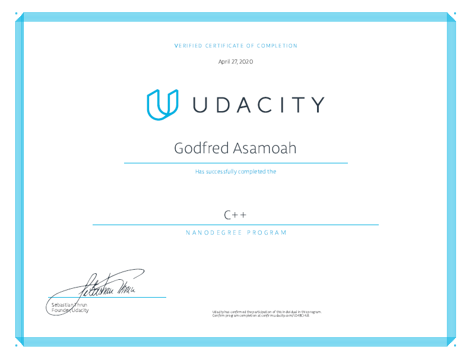

# C++ Nanodegree Projects

This repository contains my projects for Udacity's [C++ Nanodegree Program](https://www.udacity.com/course/c-plus-plus-nanodegree--nd213).

## Projects

- [1 - Route Planner](/1-route-planner): Use OpenStreetMap data and the IO2D visualization library to build a route planner that finds a path between two points on a real-world map.

- [2 - Process Monitor](/2-system-monitor): Write object-oriented C++ to build a Linux system monitor similar to the widely used htop application.

- [3 - Memory Management Chatbot](/3-memory-management-chatbot): Optimize existing chatbot code using modern C++ memory management techniques such as smart pointers and move semantics.

- [4 - Concurrent Traffic Simulation](/4-concurrent-traffic-simulation): Build a multithreaded traffic simulator using a real urban map. Run each vehicle on a separate thread, and manage intersections to facilitate traffic flow and avoid collisions.

- [5 - Capstone Project](/5-capstone): Final capstone project for the program.

## Graduation Certificate🎉🎉

[Certificate Link](https://confirm.udacity.com/LD49CHUS)
